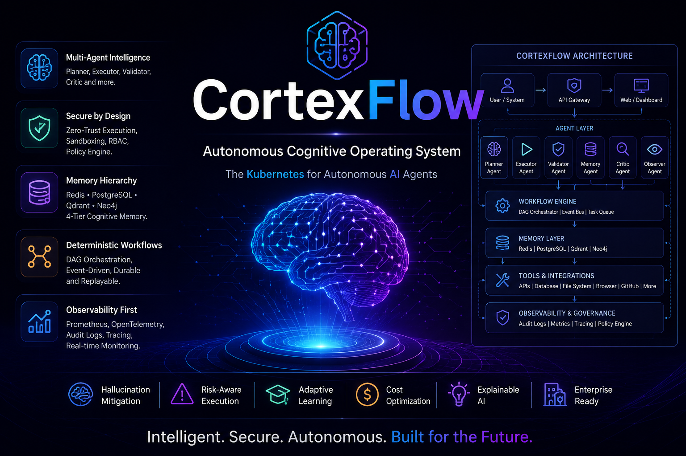

<div align="center">



<br/>

# NeuralCleave

### Your Personal AI Assistant — Smarter, Faster, and Fully Yours

<br/>

[](LICENSE)
[](https://python.org)
[](https://fastapi.tiangolo.com)
[](tests/)
[](https://github.com/TheAmitChandra/NeuralCleave/releases)

<br/>

[](https://github.com/TheAmitChandra/NeuralCleave/stargazers)
[](https://github.com/TheAmitChandra/NeuralCleave/issues)
[](CONTRIBUTING.md)

<br/>

> **One AI assistant. 32 channels. 13 LLM providers. Smarter memory. No lock-in.**

<br/>

[Website](https://neuralcleave.com) · [Docs](https://docs.neuralcleave.com) · [Quick Start](#-quick-start) · [Architecture](#-architecture) · [Channels](#-32-channel-adapters) · [Memory](#-memory-system) · [Voice](#-voice) · [CLI](#-cli) · [API](#-rest-api)

</div>

---

> **Contributing?** Read [CONTRIBUTING.md](CONTRIBUTING.md) before opening a PR — it covers dev setup, testing, and how contributions are licensed under [BUSL 1.1](LICENSE). Found a security issue? See [SECURITY.md](SECURITY.md) instead of filing a public issue. Community standards are in [CODE_OF_CONDUCT.md](CODE_OF_CONDUCT.md).

---

## What is NeuralCleave?

NeuralCleave is a **personal AI assistant gateway** — a single Python backend that connects you to every AI model and every messaging platform you already use, with a memory system that actually knows you.

- **32 channel adapters** — Telegram, Discord, Slack, WhatsApp, Email, iMessage, Teams, and 25 more, all producing a unified `InboundMessage`
- **13 LLM providers** — Anthropic, Gemini, OpenAI, DeepSeek, Mistral, Grok, Cohere, Kimi, GLM, Qwen, ERNIE, Doubao, Ollama — task-routed automatically
- **3-tier memory** — Redis (hot session) + Qdrant (vector semantic) + SQLite (long-term) — works offline, degrades gracefully
- **ReflectionEngine** — 4-dimension quality scoring (0–100) with automatic self-correction before every response
- **Voice** — local Whisper STT + 3-tier TTS (ElevenLabs → Kokoro → system) + OpenWakeWord, all offline-capable
- **Plugin SDK** — typed Python ABCs, PEP 451 entry-points, hot-reload, Hub marketplace with PackageScanner safety gate
- **Desktop app** — Tauri v2 (Windows / macOS / Linux) with system tray, global hotkey, and embedded terminal
- **PWA** — installable on iOS + Android from the gateway's own `/app` endpoint, no app store needed
- **5,064 tests** — every subsystem unit-tested, all passing

```
You (any channel) → NeuralCleave Gateway → Smart Memory → Best Model → Reflection → Reply
```

---

## Why NeuralCleave?

| Feature | Competitors | NeuralCleave |
|---|:---:|:---:|
| Language | TypeScript / Node.js | Python (better AI/ML ecosystem) |
| Memory | Flat files / LanceDB | Redis + Qdrant + SQLite (3-tier) |
| Per-agent memory isolation | ❌ | ✅ LRU namespace per orchestrator node |
| LLM providers | 4–8 | **13** (all major + 5 Chinese providers) |
| Task-aware model routing | ❌ | ✅ 10 task types → optimal model |
| Extended thinking (Claude) | ❌ | ✅ Configurable `budget_tokens` |
| Response quality scoring | ❌ | ✅ ReflectionEngine (4D, 0–100, auto-retry) |
| Local / offline mode | Limited | ✅ Full Ollama support; privacy mode toggle |
| Voice (STT + TTS) | Mobile-only | ✅ Whisper + ElevenLabs/Kokoro/system |
| Wake word detection | macOS + iOS | ✅ OpenWakeWord (all platforms) |
| Voice cloning | ❌ | ✅ `neuralcleave voice clone` |
| Desktop app | ✅ | ✅ Tauri v2 — Windows / macOS / Linux |
| Mobile companion | Native apps | ✅ PWA from gateway — no app store |
| Plugin SDK | Markdown files | ✅ Typed ABCs + PEP 451 entry-points |
| Hub marketplace | 3,500+ skills | ✅ PackageScanner safety gate (no ClawHavoc) |
| Agent orchestrator | Cross-machine | ✅ Multi-node, priority routing, namespace isolation |
| Canvas (visual output) | ✅ | ✅ Live block renderer + WebSocket broadcast |
| Prometheus metrics | ❌ | ✅ 13 built-in metrics |
| Structured logging | stdout | ✅ JsonFormatter + ContextLogger |
| REST API surface | Limited docs | ✅ 41 documented endpoints + OpenAPI |
| Channels | ~29 | **32** |
| Tests | ~200 | **5,064** |

---

## Architecture

```
┌──────────────────────────────────────────────────────────────────┐
│                    You (any surface)                              │
│  Telegram · Discord · Slack · WhatsApp · iMessage · Email · IRC  │
│  Teams · Matrix · Signal · Nostr · Bluesky · Twitch · 19 more   │
└────────────────────────┬─────────────────────────────────────────┘
                         │  InboundMessage (normalised)
┌────────────────────────▼─────────────────────────────────────────┐
│          FastAPI Gateway  (127.0.0.1:7432)                        │
│  POST /api/v1/chat   ·   GET /health   ·   41 REST endpoints     │
│  WS /ws/chat (streaming)  ·  WS /ws/canvas (live blocks)        │
└──────────┬───────────────────────────────────────────────────────┘
           │
    ┌──────▼──────────────────────────────────────────────────┐
    │               AgentOrchestrator                          │
    │  Named nodes · task/keyword/channel routing              │
    │  Priority + round-robin · per-node MemoryNamespaceStore  │
    └──────┬───────────────────┬────────────────────────────────┘
           │                   │
  ┌────────▼────────┐  ┌───────▼──────────────────────────────┐
  │  3-Tier Memory  │  │  Task-Aware ModelRouter (13 providers) │
  │                 │  │                                        │
  │  Redis (hot)    │  │  complex_reasoning → Claude Opus 4.8  │
  │  Qdrant (ANN)   │  │  code_generation   → DeepSeek Coder   │
  │  SQLite (long)  │  │  summarization     → Gemini 2.5 Flash │
  │  + Compactor    │  │  cheap_inference   → Ollama (offline)  │
  │  + Archiver     │  └───────────────────────────────────────┘
  └─────────────────┘          │
           │            ┌──────▼──────────────────────────────┐
           │            │  ReflectionEngine                    │
           │            │  Relevance · Completeness · Accuracy │
           │            │  Tone · Score 0–100 · Auto-retry     │
           └────────────┴──────────────────────────────────────┘
```

---

## Quick Start

### Prerequisites

- Python 3.12+
- Git

### Install

```bash
# One-liner (Linux / macOS)
curl -fsSL https://neuralcleave.com/install.sh | bash

# One-liner (Windows PowerShell)
iwr -useb https://neuralcleave.com/install.ps1 | iex

# Or via pip
pip install neuralcleave

# Or from source
git clone https://github.com/TheAmitChandra/NeuralCleave.git
cd NeuralCleave
pip install -e ".[dev]"
```

### Initialise and start

```bash
# Interactive setup wizard
neuralcleave init

# Non-interactive (CI / Docker)
neuralcleave init -y

# Start the gateway
neuralcleave start

# Chat from the terminal
neuralcleave chat
```

### Docker

```bash
docker run -d \
  --name neuralcleave \
  -p 7432:7432 \
  -v ~/.neuralcleave:/root/.neuralcleave \
  -e ANTHROPIC_API_KEY=sk-ant-... \
  -e TELEGRAM_BOT_TOKEN=1234:ABC... \
  ghcr.io/theamitchandra/neuralcleave:latest

curl http://localhost:7432/health
# → {"status":"ok","version":"2.1.0","agent":"NeuralCleave"}
```

Or with Redis + Qdrant included:

```bash
docker compose up -d
```

---

## 32 Channel Adapters

Every channel produces a normalised `InboundMessage`:

```python
@dataclass
class InboundMessage:
    channel:    str           # "telegram" | "discord" | "slack" | ...
    sender_id:  str
    text:       str | None
    attachments: list[Attachment]
    session_id: str
    timestamp:  float
    raw:        dict          # full platform payload
```

| # | Channel | Transport | Auth |
|---|---|---|---|
| 1 | **Telegram** | python-telegram-bot v21 | Bot token |
| 2 | **Discord** | discord.py v2, gateway WS | Bot token |
| 3 | **Slack** | slack-bolt Socket Mode | App token |
| 4 | **WhatsApp** | Meta Cloud API v19 | Verify token |
| 5 | **Email** | IMAP poll + SMTP (aiosmtplib) | STARTTLS |
| 6 | **SMS / Twilio** | TwiML webhook | HMAC-SHA1 |
| 7 | **Microsoft Teams** | Azure Bot Framework | OAuth2 24h token |
| 8 | **Google Chat** | aiohttp webhook | Service account JWT |
| 9 | **Matrix** | matrix-nio sync\_forever | Access token |
| 10 | **IRC** | asyncio RFC1459 | SASL PLAIN |
| 11 | **Signal** | signal-cli subprocess | JSON-RPC daemon |
| 12 | **LINE** | aiohttp webhook | HMAC-SHA256 |
| 13 | **Feishu / Lark** | aiohttp webhook | Tenant access token |
| 14 | **iMessage** | BlueBubbles REST poll | Password |
| 15 | **Synology Chat** | aiohttp outgoing webhook | Token |
| 16 | **Nostr** | WebSocket relay, NIP-04 | secp256k1 keypair |
| 17 | **Twilio Voice** | TwiML asyncio.Future | HMAC-SHA1 |
| 18 | **Zalo OA** | aiohttp webhook | OAuth2 + HMAC-SHA256 |
| 19 | **WeChat Work** | aiohttp webhook | SHA1 challenge |
| 20 | **QQ Bot** | aiohttp webhook, op=13 | HMAC-SHA256 |
| 21 | **Tlon / Urbit** | Eyre SSE + HTTP API | Session cookie |
| 22 | **Facebook Messenger** | Meta Graph API v19 | HMAC-SHA256 |
| 23 | **Rocket.Chat** | DDP WebSocket | REST v1 login |
| 24 | **Twitch** | IRC-over-WebSocket IRCv3 | OAuth token |
| 25 | **Bluesky** | AT Protocol XRPC poll | App password + JWT |
| 26 | **Viber** | REST + webhook | HMAC-SHA256 |
| 27 | **XMPP / Jabber** | slixmpp (MUC + 1:1) | SASL PLAIN / SCRAM |
| 28 | **Mattermost** | WebSocket events + REST v4 | Access token |
| 29 | **Mastodon** | Mastodon.py streaming | OAuth2 |
| 30 | **Nextcloud Talk** | OCS v2 REST long-poll | HTTP Basic |
| 31 | **Generic Webhook** | aiohttp POST | HMAC-SHA256 (opt.) |
| 32 | **Built-in WS / REST** | `/ws/chat` + `/api/v1/chat` | X-API-Key (opt.) |

Configure any channel in `~/.neuralcleave/config.toml`:

```toml
[channels.telegram]
bot_token = "ENV:TELEGRAM_BOT_TOKEN"

[channels.discord]
bot_token = "ENV:DISCORD_BOT_TOKEN"

[channels.slack]
app_token = "ENV:SLACK_APP_TOKEN"
```

---

## Memory System

```
Every request
      │
      ├─ Redis (short-term)  score 1.0   active session keys, TTL 1h
      ├─ Qdrant (semantic)   score = ANN cosine, top-k=5, min=0.6
      └─ SQLite (long-term)  score = importance × 0.6
              │
        MD5 content dedup
              │
        Score-ranked, capped at top_k
              │
        Injected as context blocks before LLM call
```

All tiers degrade gracefully — if Redis or Qdrant is unavailable the pipeline continues with what's reachable.

### Per-node memory isolation

Each `AgentOrchestrator` node owns a private `MemoryNamespaceStore` (LRU key-value, default `max_entries=1000`). Nodes are auto-isolated by name; explicit `memory_namespace` lets nodes share a pool.

```python
from neuralcleave.orchestrator import AgentOrchestrator
from neuralcleave.orchestrator.node import AgentNodeConfig

orch = AgentOrchestrator()
orch.register(AgentNodeConfig(name="code"))
orch.register(AgentNodeConfig(name="review", memory_namespace="code"))  # shared

orch.memory_for_node("code").put("lang", "Python 3.12")

# REST
# GET    /api/v1/orchestrator/nodes/{name}/memory
# DELETE /api/v1/orchestrator/nodes/{name}/memory
# GET    /api/v1/orchestrator/namespaces
```

### Session compaction

When conversation history hits 50% of the model's token budget, the `MemoryCompactor` summarises the oldest half into a single `archive_summary` entry via an LLM call, keeping the context window usable indefinitely.

```bash
# Trigger manually
curl -X POST http://localhost:7432/api/v1/memory/compact \
     -H "Content-Type: application/json" \
     -d '{"session_id": "abc123"}'
```

---

## LLM Providers (13)

NeuralCleave routes each request to the optimal model based on task type. All keys use `ENV:` resolution — no secrets in config files.

| Provider | Alias | Task strengths |
|---|---|---|
| **Anthropic** | `anthropic` | Complex reasoning, extended thinking |
| **Google Gemini** | `gemini` | Summarisation, cheap inference, general |
| **OpenAI** | `openai` | Code review, fallback for most tasks |
| **DeepSeek** | `deepseek` | Code generation, code review |
| **Mistral AI** | `mistral` | Complex reasoning fallback |
| **xAI Grok** | `xai`, `grok` | Complex reasoning |
| **Cohere** | `cohere` | Summarisation |
| **Moonshot / Kimi** | `kimi`, `moonshot` | General |
| **Zhipu GLM** | `zhipu`, `glm` | Intent extraction, cheap inference |
| **Alibaba Qwen** | `qwen`, `alibaba` | Code generation |
| **Baidu ERNIE** | `baidu`, `ernie` | General |
| **ByteDance Doubao** | `bytedance`, `doubao` | Cheap inference |
| **Ollama** | `ollama` | Offline / privacy mode (any local model) |

```python
from neuralcleave.models.router import ModelRouter

router = ModelRouter(anthropic_api_key="...", gemini_api_key="...")

result = await router.generate("Explain this stack trace", task_type="code_review")
print(result.text, result.model)   # answered by DeepSeek Coder (or fallback)

# Claude extended thinking
result = await router.generate(
    "Work through this proof",
    task_type="complex_reasoning",
    extended_thinking=True,
    thinking_budget_tokens=8000,
)
print(result.thinking)   # the reasoning trace
```

Override all routing at runtime:

```bash
curl -X POST http://localhost:7432/api/v1/settings/model \
     -H "Content-Type: application/json" \
     -d '{"provider": "ollama", "model": "llama3.2"}'
```

---

## Voice

Full voice pipeline — all processing runs locally, no audio leaves the device unless you opt into ElevenLabs.

```
Microphone
    │
OpenWakeWord  ←── always-on, cross-platform (.tflite models)
    │ wake word
Whisper STT   ←── faster-whisper, tiny → large-v3, CPU or CUDA
    │ text
AgentRuntime  ←── full chat pipeline
    │ response
TTS Engine    ←── ElevenLabs → Kokoro (local) → pyttsx3 (system)
    │
Speaker
```

```bash
# Enable in config.toml
[voice]
enabled          = true
stt_model        = "base"      # tiny | base | small | medium | large-v3
tts_provider     = "kokoro"    # elevenlabs | kokoro | pyttsx3
wake_word_enabled = true
wake_word_model  = "hey_jarvis"

# Start continuous listener
neuralcleave voice start

# Clone a custom ElevenLabs voice
neuralcleave voice clone --name "MyVoice" --audio reference.wav
```

```python
from neuralcleave.voice.stt import WhisperSTT
from neuralcleave.voice.tts import TTSEngine

stt = WhisperSTT(model_size="base")
text = await stt.transcribe(audio_bytes)

tts = TTSEngine()                         # ElevenLabs → Kokoro → pyttsx3
audio = await tts.synthesize("Hello!")    # returns bytes (MP3)
```

---

## Plugin SDK

Plugins are standard Python packages discovered at startup via PEP 451 entry-points. Hot-reload with no gateway restart.

```python
from neuralcleave_sdk import Tool, ToolResult, Plugin, PluginMetadata

class WeatherTool(Tool):
    name        = "get_weather"
    description = "Get current weather for a city."
    parameters  = {"type": "object", "properties": {"city": {"type": "string"}}, "required": ["city"]}

    async def execute(self, city: str) -> ToolResult:
        return ToolResult(success=True, data={"temp": "22°C", "city": city})

class WeatherPlugin(Plugin):
    metadata = PluginMetadata(name="neuralcleave-weather", version="1.0.0",
                              description="Weather via OpenWeatherMap")
    def get_tools(self): return [WeatherTool()]
```

```toml
# pyproject.toml
[project.entry-points."neuralcleave.plugins"]
neuralcleave_weather = "neuralcleave_weather.plugin:WeatherPlugin"
```

```bash
pip install neuralcleave-weather          # install
neuralcleave plugins reload               # hot-reload (no restart)
neuralcleave hub search weather           # browse Hub marketplace
neuralcleave hub install neuralcleave-weather
```

Three reference plugins in `examples/plugins/`: `neuralcleave-github`, `neuralcleave-notion`, `neuralcleave-google-calendar`.

---

## REST API

41 endpoints under `/api/v1/`, plus 2 WebSocket endpoints. Full interactive docs at `http://localhost:7432/docs` (Swagger UI) when the gateway is running.

| Domain | Endpoints |
|---|---|
| Health | `GET /health` |
| Chat | `POST /api/v1/chat` · `WS /ws/chat` |
| Memory | 6 endpoints — list, search, store, delete, compact |
| Channels | 3 endpoints — list, detail, send |
| Plugins | 4 endpoints — list, detail, reload all, reload one |
| Hub | 8 endpoints — list, search, install, uninstall, enable/disable, scan, status |
| Orchestrator | 9 endpoints — nodes CRUD, route, status, memory, namespaces |
| Canvas | 4 endpoints + `WS /ws/canvas` |
| Settings | 3 endpoints — get all, override model, toggle privacy |
| Metrics | `GET /api/v1/metrics` (Prometheus text/plain) |
| Push (PWA) | 5 endpoints — VAPID key, subscribe, unsubscribe, list, notify |
| Sessions | 2 endpoints — list, disconnect |

```bash
# Chat
curl -X POST http://localhost:7432/api/v1/chat \
  -H "Content-Type: application/json" \
  -d '{"message": "What is the capital of France?", "session_id": "s1"}'

# Check metrics
curl http://localhost:7432/api/v1/metrics
```

When `gateway.api_key` is set, include `X-API-Key: <key>` on all `/api/*` requests (`/health` and `/ws/*` are always exempt).

---

## CLI

```
neuralcleave start               Start gateway + all configured channels
neuralcleave start --background  Start as a background daemon
neuralcleave stop                Stop the background daemon
neuralcleave status              Gateway / model / voice / memory summary

neuralcleave init                Interactive first-run wizard
neuralcleave init -y             Non-interactive (CI / Docker)

neuralcleave chat                Interactive terminal chat

neuralcleave plugins list        List loaded plugins and tools
neuralcleave plugins reload      Hot-reload all plugins (no restart)

neuralcleave hub list            Browse Hub marketplace
neuralcleave hub install <pkg>   Install a Hub package
neuralcleave hub search <q>      Search packages

neuralcleave voice start         Start continuous voice listener
neuralcleave voice stop          Stop voice listener
neuralcleave voice clone         Clone an ElevenLabs voice from audio

neuralcleave orchestrate list    List orchestrator nodes
neuralcleave orchestrate add     Register a new node
neuralcleave orchestrate route   Test routing for a task type

neuralcleave canvas open         Open live canvas in browser
neuralcleave skills list         List installed skill packages

neuralcleave autostart enable    Register gateway at OS login
neuralcleave autostart disable   Remove OS login registration

neuralcleave cloud deploy        Deploy to Railway / Render / Fly
neuralcleave cloud logs          Stream live logs from cloud

neuralcleave sandbox status      Show sandbox backend status
```

---

## Configuration

```toml
# ~/.neuralcleave/config.toml
# All string values support ENV:VAR_NAME — resolved at startup, never stored

[agent]
name        = "NeuralCleave"
description = "My personal AI assistant"

[gateway]
host      = "127.0.0.1"
port      = 7432
api_key   = ""              # set to require X-API-Key on all /api/* routes
log_level = "INFO"

[models]
primary_provider  = "anthropic"
primary_model     = "claude-sonnet-4-6"
anthropic_api_key = "ENV:ANTHROPIC_API_KEY"
openai_api_key    = "ENV:OPENAI_API_KEY"
gemini_api_key    = "ENV:GEMINI_API_KEY"
deepseek_api_key  = "ENV:DEEPSEEK_API_KEY"
ollama_url        = "http://localhost:11434"
extended_thinking = false

[memory]
redis_url           = "redis://localhost:6379/0"
session_ttl_seconds = 3600
qdrant_url          = "http://localhost:6333"

[voice]
enabled           = false
stt_model         = "base"     # tiny | base | small | medium | large-v3
tts_provider      = "kokoro"   # elevenlabs | kokoro | pyttsx3
wake_word_enabled = false
wake_word_model   = "hey_jarvis"

[scheduler]
enabled = true

[channels.telegram]
bot_token = "ENV:TELEGRAM_BOT_TOKEN"

[channels.discord]
bot_token = "ENV:DISCORD_BOT_TOKEN"
```

---

## Observability

```
GET /api/v1/metrics  →  Prometheus text/plain (scrape directly)
```

| Metric | Type | What it tracks |
|---|---|---|
| `nc_requests_total` | Counter | Total chat requests by channel + provider |
| `nc_request_duration_seconds` | Histogram | End-to-end latency |
| `nc_llm_tokens_input_total` | Counter | Prompt tokens sent |
| `nc_llm_tokens_output_total` | Counter | Completion tokens received |
| `nc_llm_errors_total` | Counter | Provider failures by error type |
| `nc_reflection_score` | Gauge | Most recent quality score (0–100) |
| `nc_reflection_retries_total` | Counter | Responses regenerated by ReflectionEngine |
| `nc_memory_rows_total` | Gauge | SQLite long-term memory row count |
| `nc_memory_compactions_total` | Counter | Session compaction events |
| `nc_active_sessions` | Gauge | Active WebSocket sessions |
| `nc_plugin_tool_calls_total` | Counter | Plugin tool invocations by plugin + tool |
| `nc_channel_messages_total` | Counter | Inbound messages per channel |
| `nc_orchestrator_routes_total` | Counter | Routing decisions by node + task type |

A pre-built Grafana dashboard is in `deploy/grafana/neuralcleave-dashboard.json`.

---

## Deployment

```bash
# Docker
docker compose up -d

# Railway / Render — set env vars, push Dockerfile
# neuralcleave cloud CLI
neuralcleave cloud deploy
neuralcleave cloud logs --follow
```

See the full [Deployment guide](https://docs.neuralcleave.com/docs/deployment.html).

---

## Testing

```bash
pip install -e ".[dev]"

pytest                                              # all 5,064 tests
pytest tests/unit/test_memory.py -v                # single module
pytest -k "telegram" -v                            # by keyword
pytest --cov=backend --cov-report=term-missing     # with coverage
```

All async tests use `pytest-asyncio` with `asyncio_mode = "auto"` — no per-test decorator needed. LLM provider tests use pre-recorded responses; no real API keys required for CI.

---

## Project Structure

```
NeuralCleave/
├── backend/
│   ├── gateway/           FastAPI app, 41 REST endpoints, WebSocket, auth middleware
│   ├── channels/          32 adapters behind one ChannelAdapter ABC
│   ├── agent/             AgentRuntime, CognitivePipeline, SessionManager
│   ├── memory/            3-tier retrieval, compactor, archiver, tagging
│   ├── models/            ModelRouter, 13 provider modules
│   ├── orchestrator/      AgentOrchestrator, MemoryNamespaceStore
│   ├── canvas/            CanvasRenderer, WS broadcast, REST routes
│   ├── reflection/        ReflectionEngine, 4D scoring
│   ├── voice/             WhisperSTT, TTSEngine, WakeWordDetector, ContinuousListener
│   ├── plugins/           PluginRegistry, entry-point discovery, hot-reload
│   ├── hub/               HubRegistry, HubInstaller, PackageScanner
│   ├── pwa/               PWA manifest, Service Worker, Web Push routes
│   ├── sandbox/           LocalSandbox, DockerSandbox, SSHSandbox
│   └── tools/             ShellTool, BrowserTool, FileOpsTool, SkillWriter
├── neuralcleave_sdk/      Typed ABCs for plugin authors (published on PyPI)
├── examples/plugins/      neuralcleave-github, neuralcleave-notion, neuralcleave-google-calendar
├── frontend/              Next.js dashboard (Tauri v2 shell)
├── docs-site/             Technical docs — live at docs.neuralcleave.com
├── docs/
│   ├── SKILL.md                      Implementation knowledge base
│   ├── COMPETITIVE_ANALYSIS_OPENCLAW.md
│   └── IMPLEMENTATION_PLAN_v2.md
├── tests/
│   ├── unit/              5,064 tests, all passing
│   └── integration/
├── scripts/               install.sh, install.ps1, bundle_backend.*
├── .github/workflows/     ci.yml, plugins.yml, deploy-docs.yml, build-tauri.yml
├── Dockerfile
├── docker-compose.yml
└── pyproject.toml         `neuralcleave` entry point + pytest/ruff config
```

---

## Desktop App

NeuralCleave ships a native desktop app built with [Tauri v2](https://v2.tauri.app).

| Feature | Description |
|---|---|
| **Chat** | Streaming AI responses from any configured model |
| **Memory browser** | Browse, search, edit, and delete long-term memory |
| **Orchestrator** | View nodes, routing rules, per-node namespace stats |
| **Canvas** | Live block renderer — text, markdown, code, charts, images |
| **Skills** | Browse and manage Hub marketplace packages |
| **Channels** | Connect and monitor all 32 adapters |
| **Observability** | Real-time metrics, token usage, latency charts |
| **System tray** | Ctrl+Shift+Space global hotkey; native notifications |
| **Auto-start** | Optional launch at OS login |

Download from [Releases](https://github.com/TheAmitChandra/NeuralCleave/releases) (`.exe` / `.dmg` / `.deb` / `.AppImage`).

---

## Documentation

Full technical documentation at **[docs.neuralcleave.com](https://docs.neuralcleave.com)**

| Page | What's covered |
|---|---|
| [Getting Started](https://docs.neuralcleave.com/docs/getting-started.html) | Install, init, start, Docker, PWA, autostart |
| [Architecture](https://docs.neuralcleave.com/docs/architecture.html) | Pipeline, routing algorithm, ReflectionEngine |
| [Memory System](https://docs.neuralcleave.com/docs/memory.html) | 3-tier, compaction, archiver, namespace isolation |
| [LLM Providers](https://docs.neuralcleave.com/docs/llm-providers.html) | All 13 providers, task routing, extended thinking |
| [Channels](https://docs.neuralcleave.com/docs/channels.html) | All 32 adapters with TOML config examples |
| [Configuration](https://docs.neuralcleave.com/docs/configuration.html) | Full TOML reference, ENV: secrets |
| [CLI Reference](https://docs.neuralcleave.com/docs/cli.html) | All subcommands with flags |
| [REST API](https://docs.neuralcleave.com/docs/api.html) | All 41 endpoints + 2 WebSocket |
| [Plugin SDK](https://docs.neuralcleave.com/docs/plugins.html) | Tool, Plugin, ChannelAdapter, Hub, PackageScanner |
| [Voice](https://docs.neuralcleave.com/docs/voice.html) | Whisper, TTS tiers, wake word, cloning |
| [Observability](https://docs.neuralcleave.com/docs/observability.html) | 13 Prometheus metrics, ContextLogger, Grafana |
| [Deployment](https://docs.neuralcleave.com/docs/deployment.html) | Docker, Railway, Render, cloud CLI |
| [Testing](https://docs.neuralcleave.com/docs/testing.html) | Test suite structure, writing tests, CI |

---

## License

[Business Source License 1.1](LICENSE) — free for non-production use (development, evaluation, personal use). Production use requires a commercial license — contact [ask.amitchandra@gmail.com](mailto:ask.amitchandra@gmail.com). Converts automatically to Apache 2.0 on 2030-06-26.

The plugin SDK (`neuralcleave-sdk`) is MIT licensed and published separately on PyPI.

---

<div align="center">

**NeuralCleave** — Built for people who want their AI to actually know them.

Created by [Amit Chandra](https://theamitchandra.github.io/My-Portfolio)

[Website](https://neuralcleave.com) · [Docs](https://docs.neuralcleave.com) · [GitHub](https://github.com/TheAmitChandra/NeuralCleave)

</div>
