# CortexFlow — Deep Project Analysis & Skills File Report

## What I Did

I performed a **full deep analysis** of your CortexFlow repository and built a comprehensive **Knowledge Item (KI)** that I will automatically load and use every time you ask me to work on this project.

---

## Project Summary

**CortexFlow** is a production-grade **Autonomous Cognitive Operating System** — essentially "Kubernetes for AI Agents." It is designed for enterprise sale to companies like OpenAI and Microsoft.

> [!IMPORTANT]
> All 12 core modules have code scaffolded. The project is in **Phase 1 (Foundation)** with infrastructure, FastAPI, auth, and observability built. Memory, security, orchestration, and other modules have implementations that need to be completed and integrated.

---

## What Exists Today (Implemented)

```mermaid
graph TD
    A[FastAPI Main App] --> B[Auth JWT]
    A --> C[Agent CRUD API]
    A --> D[Workflow API]
    A --> E[Memory API]
    A --> F[Tools API]
    A --> G[Events API]
    A --> H[Approvals API]
    A --> I[MCP API]
    A --> J[WebSocket Streams]
    A --> K[Observability API]

    L[Core Modules - SCAFFOLDED] --> M[Agent Runtime ✅]
    L --> N[Orchestration - 8 agents ✅]
    L --> O[Memory - 4 tiers ✅]
    L --> P[Workflow Engine + DAG ✅]
    L --> Q[Security + Zero Trust ✅]
    L --> R[Tool Registry ✅]
    L --> S[Reflection Engine ✅]
    L --> T[Events Bus ✅]
    L --> U[Adaptive Learning ✅]
    L --> V[Observability Stack ✅]
    L --> W[Model Router ✅]
    L --> X[Governance RBAC ✅]

    Y[Database Layer] --> Z[PostgreSQL async - ORM models]
    Y --> AA[Qdrant - vector search]
    Y --> AB[Neo4j - knowledge graph]
    Y --> AC[Redis - cache + broker]

    AD[Frontend Next.js 14] --> AE[Dashboard shell]
    AD --> AF[Agent Graph - React Flow]
    AD --> AG[Workflow Builder]
    AD --> AH[All 7 pages scaffolded]

    AI[Tests - 40 unit test files] --> AJ[All modules covered]
    AK[Deploy] --> AL[Docker Compose dev + prod]
    AK --> AM[Kubernetes manifests]
    AK --> AN[Prometheus + Grafana + OTEL]
```



---

## Architecture Overview

| Layer | Technology | Status |
|---|---|---|
| API Gateway | FastAPI 0.115.5 + JWT + Rate Limiting | ✅ Built |
| Agent Runtime | Python AsyncIO + State Machine | ✅ Scaffolded |
| Multi-Agent Orchestration | 8 Specialized Agents via Redis pub/sub | ✅ Scaffolded |
| Memory (4-tier) | Redis + Qdrant + PostgreSQL + Neo4j | ✅ Scaffolded |
| Workflow Engine | Celery DAG + Checkpoints + Recovery | ✅ Scaffolded |
| Security | Zero-Trust + Docker Sandbox + Prompt Injection Defense | ✅ Scaffolded |
| Tools | Registry + Browser + Shell + File + API + DB | ✅ Scaffolded |
| Reflection | Quality Scorer + Hallucination Detector | ✅ Scaffolded |
| Observability | Prometheus + OpenTelemetry + Audit Trail | ✅ Scaffolded |
| Model Router | Gemini + DeepSeek + Ollama + Token Budget | ✅ Scaffolded |
| Governance | RBAC + Policy Engine + Approval Workflows | ✅ Scaffolded |
| Adaptive Learning | RL Optimizer + Predictor + Failure Detector | ✅ Scaffolded |
| Frontend | Next.js 14 + shadcn/ui + React Flow + Zustand | ✅ Partially built |
| CI/CD | GitHub Actions + Docker + K8s | ✅ Configured |

---

## Skills File Built

I created a **master Knowledge Item** that I will automatically use every time you ask me to work on CortexFlow. It contains:

| Section | Coverage |
|---|---|
| Project identity & vision | ✅ |
| **Absolute workflow rules** (one file = one commit) | ✅ |
| Complete technology stack (all packages + versions) | ✅ |
| Full project file structure | ✅ |
| Backend coding conventions | ✅ |
| Frontend coding conventions | ✅ |
| All 12 module specs | ✅ |
| Database schemas (PostgreSQL + Neo4j + Qdrant) | ✅ |
| All API endpoints | ✅ |
| Celery queue architecture | ✅ |
| Environment variables | ✅ |
| Dev quick-start commands | ✅ |
| Testing requirements | ✅ |
| Security non-negotiables | ✅ |
| 11-stage cognitive pipeline | ✅ |
| Frontend dashboard pages | ✅ |
| Development phases + roadmap | ✅ |
| SLO / benchmark targets | ✅ |
| MCP compatibility | ✅ |
| Known gotchas & architectural decisions | ✅ |
| Competitive positioning | ✅ |
| Agent identity model | ✅ |

---

## Key Gotchas I Discovered

> [!WARNING]
> **`requirements.txt` has a duplicate `mypy==1.13.0` line** — harmless but should be cleaned up.

> [!NOTE]
> **`backend/app/schemas/` is nearly empty** — only `auth.py` exists. All other module request/response schemas need to be created as development progresses through phases.

> [!IMPORTANT]
> **Frontend uses pnpm** — always run `pnpm` commands, never `npm`. The workspace uses `pnpm-workspace.yaml`.

> [!CAUTION]
> **Celery: always specify ALL queues** when starting workers. Omitting a queue means those tasks will pile up unprocessed. The full command is:
> ```bash
> celery -A app.workers.celery_app worker --loglevel=info -Q planning_queue,execution_queue,validation_queue,reflection_queue,high_priority_queue
> ```

---

## What To Build Next

Based on the Phase 1 status, here are logical next development priorities:

### Immediate (Phase 1 completion)
1. **Complete Pydantic schemas** for all API endpoints (currently only `auth.py` exists)
2. **Run and fix the existing 40 unit tests** to ensure current code passes CI
3. **Wire up the Gemini API integration** into the model router and agent runtime
4. **Frontend auth flow** — login page → JWT → protected routes

### Phase 2 targets
1. Connect memory module to real Qdrant + Neo4j calls
2. Implement tool registry with browser (Playwright) + shell tools
3. Build the workflow DAG execution with Celery chains/chords
4. Memory retrieval pipeline (embedding → ANN → rerank → hybrid merge)

---

## How to Use Me Effectively

Simply ask me to work on any part of CortexFlow and I will automatically have this full context. For example:
- *"Implement the memory retrieval pipeline"*
- *"Add the agent trust score to the AgentIdentity model"*
- *"Fix the failing unit tests for the planner agent"*
- *"Build the approval queue UI in the Security Center page"*

> [!TIP]
> Use `/goal` slash command for large overnight tasks like "implement Phase 2 completely" and I'll run autonomously until done.
