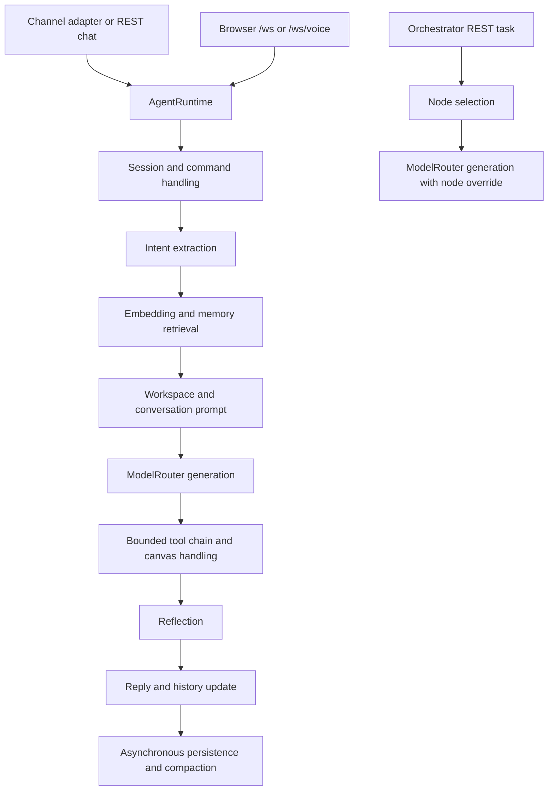

# Architecture and contracts

Source baseline: checkout `fb506b98`, inspected 2026-09-06. Paths are repository-relative. These describe local source, not verified external provider capabilities.

## Product and entry points

The Python package is a personal assistant gateway connecting messaging channels and browser/desktop surfaces to task-aware generation, memory, tools, and voice. `pyproject.toml` declares Python >=3.12 and console scripts `neuralcleave = neuralcleave.cli:main` and `neuralcleave-desktop = neuralcleave.desktop_launcher:main`. At inspection, package/frontend/Tauri version is 2.1.5. The independent `neuralcleave-sdk` is version 0.1.3, Python >=3.10, with no runtime dependencies. Do not synchronize these versions automatically.

| Area | Primary source | Responsibility |
| --- | --- | --- |
| CLI/config | `neuralcleave/cli.py`, `config.py`, `workspace.py` | Setup, commands, TOML configuration, prompt workspace |
| Application wiring | `neuralcleave/gateway/main.py` | `create_app`, lifespan, runtime/plugin/orchestrator setup, readiness |
| REST | `neuralcleave/gateway/routes.py` | Status, sessions, channels, memory, settings, voice, plugins, approvals, orchestration |
| Chat/session | `neuralcleave/agent/runtime.py`, `session.py`, `pipeline.py` | Adapters, commands, history, generation, tools, reflection, persistence |
| Models | `neuralcleave/models/router.py`, `health.py`, `pricing.py`, `thinking.py` | Routing, fallback, streaming, configuration, provider metadata and usage |
| Memory | `neuralcleave/memory/` | Redis/fallback, semantic retrieval, SQLite, compaction, archival, tags |
| Tools and approvals | `neuralcleave/tools/` | Tool interfaces/registry, tool chain, shell/browser gates and approvals |
| Extensibility | `neuralcleave/plugins/`, `skills/`, `hub/`, `neuralcleave-sdk/` | Plugin discovery/state, Python skill review/loading, installation, SDK |
| Specialized agents | `neuralcleave/orchestrator/` | Eligibility, priority/round-robin selection, model override, namespace store |
| Visual/voice clients | `neuralcleave/canvas/`, `pwa/`, `voice/` | Canvas, gateway-hosted PWA, audio capture/transcription/synthesis |
| Observability | `neuralcleave/observability/`, `privacy/` | Metrics/logging, provider-call audit, privacy reporting |
| Dashboard | `frontend/src/app/(dashboard)/`, `components/`, `lib/`, `store/` | Next.js App Router, React Query, Zustand, REST and WebSocket clients |
| Desktop | `frontend/src-tauri/`, `frontend/scripts/`, `neuralcleave/desktop_launcher.py`, `neuralcleave-backend.spec` | Rust/Tauri shell and bundled Python sidecar |

`backend/` remains a distinct earlier FastAPI application. `deprecated/`, `docs/CORTEXFLOW*`, and enterprise deployment files are historical context, not the default implementation map.

## Runtime and message lifecycle

`create_app()` configures origins, optional REST API-key enforcement, and routers. Lifespan starts the WebSocket manager, canvas, scheduler, and config watcher, then schedules heavy runtime/plugin initialization in the background. `/health` is liveness; `/ready` checks initialization phase and runtime, plus any channel connection when adapters exist. Readiness does not prove a real provider call succeeds.

`AgentRuntime.from_config()` constructs one model router, retrieval pipeline, workspace loader, reflection engine, default tool registry, long-term store, cognitive pipeline, session manager, and configured voice/channel components. Startup shares the runtime's router with the orchestrator and its tool registry with plugins. The scheduler registers inactive-session archival when a long-term store is present.

`InboundMessage` and `Attachment` in `channels/base.py` are dataclasses. Adapters implement async `connect`, `disconnect`, `send`, and dispatch normalized messages to an installed callback. Add adapter construction in `AgentRuntime._make_adapter` as well as configuration/UI support when extending channels.

Pipeline `run()` extracts intent, embeds input, retrieves memory, assembles prompts, generates, routes chart data, executes a bounded tool chain (default five steps), reflects, updates session history, and schedules memory work. Long-term conversation writes also happen in the runtime. `run_stream()` streams generation, buffers tool-call marker lines, runs tools when needed, and emits a terminal result. Reflection there records a score without replacing already-emitted text. Do not assume these paths have identical text or command behavior.

## Memory identity and durability

- `Session.session_id` is deterministic `channel:sender_id`. Browser clients persist `NeuralCleave_client_id` and transmit `client_id` on reconnect. A transport connection ID is not the durable conversation identity.
- `MemoryRetrievalPipeline.retrieve(..., session_id=...)` uses the per-call ID for short-term retrieval, preventing accidental use of a static default identity.
- Long-term retrieval explicitly passes `session_id=None`: the source comments identify cross-channel recall as intentional for a single-user assistant. Semantic retrieval likewise needs separate examination before making tenant-isolation claims.
- Redis short-term storage falls back in process. Semantic retrieval uses an async Qdrant client, with an in-process vector fallback; embeddings come from `memory/embedder.py`. Missing embeddings skip semantic search. Neither in-process fallback is durable across restart.
- SQLite `LongTermMemory` persists conversations, with compaction and archival handling older context. Several writes are background tasks; a returned reply is not a transactional durability guarantee.
- `orchestrator/memory.py` exposes per-node namespaces, but `AgentOrchestrator.route()` currently calls the router directly and does not retrieve through those namespaces. Do not describe this as end-to-end agent memory isolation.

## Providers and configuration

`models/router.py` contains routing tables, model-prefix resolution, `from_config`, generation and streaming fallback, privacy mode, thinking parameters, and channel overrides. Provider keys originate in `ModelsConfig`; secret resolution supports `ENV:` and 1Password references. Audit attribution uses a `ContextVar` to avoid concurrent request identity bleed.

The router includes provider branches beyond the README's 13-provider summary, including OpenRouter, Azure, Bedrock, Groq, Together, and Fireworks. Read dispatch code and tests for the requested provider instead of relying on counts or fixed model names. Extending a provider can touch config parsing, router construction/dispatch, streaming, health/pricing, settings UI, and tests.

Default state is `~/.neuralcleave/`; gateway bind is `127.0.0.1:7432`. Configuration is dataclass/TOML based, not the older backend's Pydantic-settings model. The config watcher records the actual loaded `config_path`. Its callback applies security policy live; model keys require restart through that watcher path. Separate settings routes can have their own live-application behavior.

Workspace `SOUL.md`, `TOOLS.md`, `MEMORY.md`, and `RULES.md` shape the product's prompts. They are user runtime state, not repository coding-agent instruction files.

## Frontend and transport

`frontend/src/lib/api.ts` rereads `NeuralCleave_settings` localStorage and appends `/api/v1` to the base URL; default is `http://127.0.0.1:7432`. It migrates stored localhost API URLs to IPv4 for Windows WebView2. Avoid appending `/api/v1` twice.

`lib/websocket.ts` uses a reconnecting client with top-level frame fields. A reply comprises `message_chunk` frames containing incremental `delta`, then `message_done` containing full `text`. Do not append the full final text to existing deltas. `client_id` must remain stable across reconnects.

`lib/voice-ws.ts` creates a dedicated `ReconnectingWSClient('/ws/voice')`; MediaRecorder sends binary chunks and receives binary TTS audio and transcript events. Server-side PTT/continuous listening uses host microphone devices; browser MediaRecorder uses the browser's microphone. Diagnose the appropriate path.

REST API-key enforcement uses `X-API-Key` only when configured. Current WebSocket handlers check allowed Origin before acceptance; missing Origin is accepted. That check is not authentication, and the optional query token in the client is not evidence that the server validates it. Inspect auth at each transport boundary for remote-hosting tasks.

## Plugins, tools, and distribution

Plugin discovery uses the exact entry-point group `NeuralCleave.plugins` and synchronous `discover()`, followed by async `load_all()`. Plugin state persists separately from discovery. Plugins must populate the live tool registry to become callable.

`ToolRegistry.call()` checks configured permissions, propagates session context, and wraps execution errors in `ToolResult`. Shell/browser approval is opt-in through `require_shell_approval`; do not describe it as universally enabled.

Agent-generated code uses `WriteSkillTool` -> proposal queue -> approval -> `SkillWriter` load/register. Hub installs have a scanner and a separate installation flow. `SkillWriter` ultimately calls `exec_module` in process; the AST import blocklist does not establish runtime containment.

Tauri uses Next.js static `out/`, with a bundled `neuralcleave-backend` sidecar. Default web builds use `standalone`. Packaging changes must consider `next.config.mjs`, Tauri config/Cargo metadata, bundle scripts, PyInstaller spec, desktop launcher, and release workflow together. Root Docker and `deploy/` manifests are different deployment surfaces; inspect each before recommending commands.
